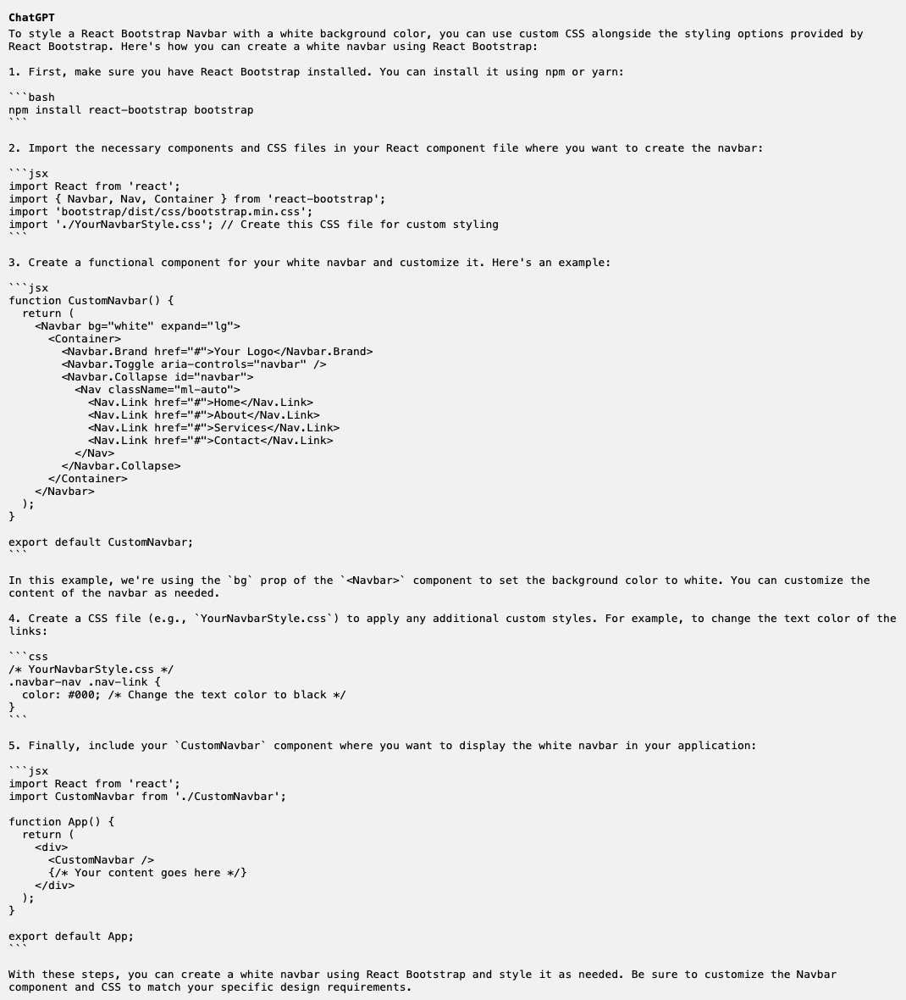
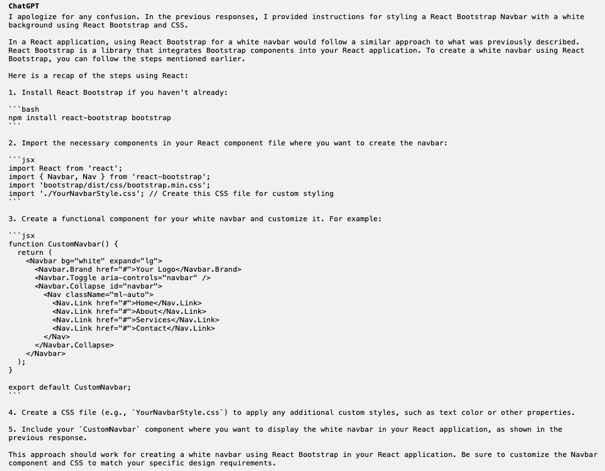
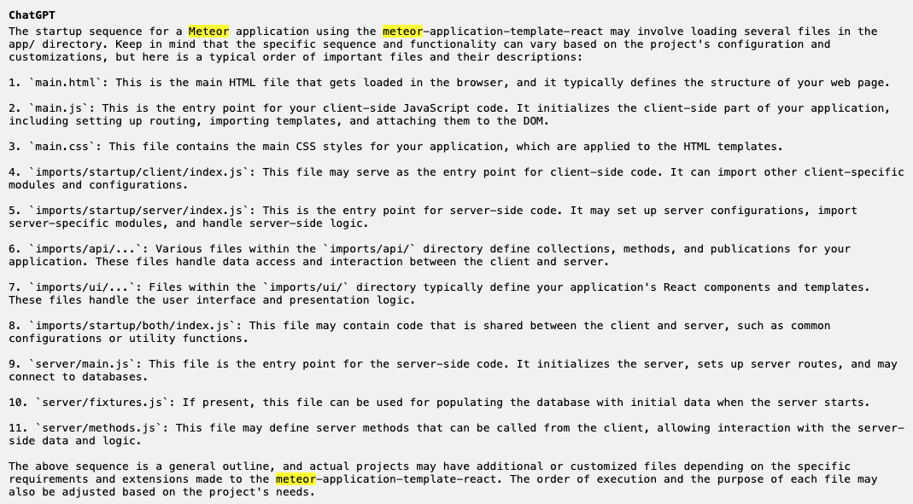

* [Introduction](#introduction)
* [Personal Experience with AI](#personal-experience-with-ai)
* [Impact on Learning and Understanding](#impact-on-learning-and-understanding)
* [Practical Applications](#practical-applications)
* [Challenges and Opportunities](#challenges-and-opportunities)
* [Comparative Analysis](#comparative-analysis)
* [Future Considerations](#future-considerations)
* [Conclusion](#conclusion)


## Introduction

Artificial Intelligence (AI) has become an inevitable part of computing for the general public with its availability. AI in education presents itself as a double-edged sword: the benefits it brings to educators working to develop a rigorous
curriculum for its students, and for the students to utilize it as a 24/7 personal assistance to get all curiosities answered. AI allows the presence of a virtual teacher in the absence of a physical one. On the other hand, as inherent with such
ability to acquire extensive answers from the AI, exploitations such as getting answers to homework problems and cheating in the form of plagiarized (stemming from the AI-generated text) work naturally result. In the frame of reference to the
University of Hawai'i at Manoa's ICS 314, Software Engineering, such duality persists: the AI allows the generation of sample codes or consolidated summaries and documentations that aid students in their understanding of software engineering
concepts; on the other hand, students could also
cause themselves to be devoid of the critical thinking process and learning required to progress through software engineering by allow AI to "do their work." Personally, for ICS 314, I have only ever used ChatGPT, a free-to-use AI chatbot, for
occasional "getting through crunch time."

## Personal Experience with AI

### Experience Practice WODs

I did not utilize ChatGPT for any of the experience practice WODs. The primary reason for not using it was because of what experiences fundamentally are. As stated on the course website: "Experiences represent "active" learning opportunities, as
opposed to readings, which represent "passive" learning opportunities." Due to this foundation, I felt it was crucial for me to fully experience each learning through engaging in the specified assignments without the use of AI. Additionally, I
felt it was sufficient to understand the concepts in the content of each module by following along the assignment. Perhaps a way I could have used AI to enhance my learning was to answer those occasional "curiosity questions" that pop up given
the extensive depth you can take with the learning of frameworks, programming languages, applications, databases, etc.

### In-class Practice WODs

Same as the above, I did not find any particularly useful occasion to utilize ChatGPT during the in-class Practice WODs. Given the availability to work with a partner, and to direct the focus of the task on hand, I was able to manage with
following along the assignment and/or consulting my partner as necessary. If it was the case that I did not prepare beforehand, i.e., by reading through the material and completing an assignment due, I may have relied on ChatGPT to "catch up" with
the current module's concepts.

### In-class WODs

There were two occasions in which I utilized ChatGPT for the In-Class WODs.

#### WOD: UI Design (React)

In the in-class WOD: UI Design (React), I utilized ChatGPT to generate code for the following prompt:

```
how to style css navbar color white with react-bootstrap
```

In the WOD, I was having difficulty adjusting the color of the text in the navbar to white. After a few attempts with trial and error, I could not seem to get it to work; thus, I resorted to using ChatGPT in an attempt to debug the code given
the time constraints. The following code response was given:



Unfortunately, the first result was not of much help; thus, I proceeded with a follow-up:

```
using react
```

Resulting in the following:




As evident, due to a lack of deliberateness in my prompt, I was unable to get the desired response from ChatGPT, Fortunately, after more trial and error I was able to set the text color to white. Nonetheless, this showcased the importance of
effective communication, even if it is to a chatbot, to ask a "smart prompt" to get the desired result.

#### Final WOD

In writing the responses for the Final WOD, I also used chatGPT to formulate my answers to the posed questions. I pasted the contents of question 1 into ChatGPT and received the following response:



I then utilized the generated list by ChatGPT to compare to the documentation from Meteor's [Default file load order](https://guide.meteor.com/structure.html#load-order). This allowed me to cross-reference the two lists, and make up for the lack
of an intuitive explanation of the documentation from Meteor with the ChatGPT's generated list, from which I formulated my response. This allowed me to formulate a thorough and confident answer given the time constraint, reducing the need to read
through the entire documentation.

### Essays

I did not utilize ChatGPT in writing my essays. "Create high quality technical essay" is a Learning Outcome of ICS 314. A naive exploitation of ChatGPT would result in prompting the chatbot to generate a sample paragraph to "write about xxx," or
even the entirety of the essay. Such use does not reflect the outcome of demonstrating my ability to write a professional-quality technical essay, nor does it accurately reflect my experiences and thoughts in this software engineering course; thus,
to prevent any potential exploitation, I chose to avoid it completely.

### Final project

As of the time of writing, I have not utilized any means of AI to assist in the final project creation. However, in the interest of time, and in the effort to better understand how AI might help in an application development process, I intend to
utilize a combination of ChatGPT and Github Copilot to assist in my code development. While fundamentally, as the developer, I have the vision of the app that I intend to create, the process necessary is hindered by my lack of thorough
understanding of how to approach it, and it may become time-consuming or tedious to "manually" input pieces of codes or know/find code blocks on how to do particular tasks. Using AI would greatly reduce the time needed in the process while
maintaining the learning integrity of understanding how the code and process are developed to achieve the effect desired in the developing application.

### Learning a concept / tutorial

I did not use AI to learn a concept/tutorial, primarily because the modules and learning experiences are structured to be tutorials to learn the concepts themselves.

### Answering a question in class or in Discord

I have not used AI in answering a question in class or in Discord. To begin, I have an inherent lack of participation to answer questions, due to other obligations or that answers have already been provided by other classmates, or I simply do not
know the answer as well, the lesson on asking. Due to this, the need to utilize AI to answer questions never arose.

### Asking or answering a smart-question

I have not used AI in asking or answering a smart question. The lesson on smart questions was thorough in its explanation of how to do it and as to which format you should use. Fortunately, the need to ask a smart question from my end never arose,
as either I was able to fulfill the assignments or another classmate had asked the question already. Arguably, to further my understanding of the material present, I could have asked smart questions along the way, and utilized AI to
verify that my "smart question" does indeed abide by the criteria set forth.

### Coding example, Writing code

My usage of AI for coding example is about the aforementioned usage of ChatGPT to generate code for react, in [Wod: UI Design (React)](#wod-ui-design-react). From the aforementioned usage, I felt I could have generated more coding
examples along the way throughout the course to obtain a better understanding of how some of the code worked.

### Explaining code

I did not particularly use AI to explain code. The documentation provided for each of the programming languages/frameworks was sufficient to understand the code along with the explanatory videos provided in the course.

### Documenting code

I did not use AI to document code. The priority of the course was not much set on documenting the code and given that we mostly utilized templates for the programming, existing documentation for the code existed and thus felt sufficient.

### Quality assurance

I did not use AI for quality assurance. Rather, the ESLint coding standard was more than sufficient in quality assurance of my code throughout this course due to its extensibility and support for JavaScript and in IntelliJ IDEA.

### Other uses in ICS 314 not listed

I do not have any other instance of AI usage of ICS 314 not listed in the aforementioned headings. Primarily, I have a limited usage with AI for the course, as I intended for my learning to be predominately through the materials presented, and
reserve AI usage to a minimum.

## Impact on Learning and Understanding

Through my ICS 314 learning experience, AI remains a cornerstone that is yet to be explored to its full potential. Given my scarce use of AI, the impact it had was minimal. For comprehension, there were undoubtedly times were the use of AI
could have furthered my understanding of certain processes and/or concepts. For skill development, I could have used it to aid in my coding in obtaining depth on the subjects touched upon in the class. For problem-solving abilities, AI has
assisted me in two ways: it has allowed me to get through certain problems by providing a sample solution and understanding better how certain programming paradigms work, such as the utilization of the JavaScript Underscore Library to perform more
complex operations. Overall, AI technologies have enhanced my understanding of software engineering concepts with the capabilities they provide, albeit not fully realized.

## Practical Applications

AI is not just limited to usages in ICS 314. It extends beyond to real-world usages, such as AI-powered assistants, natural language processing, machine learning, deep learning, e-commerce, and sentiment analysis, etc. Well-known applications
present themselves to the public as the Google Search engine, recommendations systems by YouTube, and speech recognition from Siri and Alexa. It has become an integral feature for its users of the respective services.

## Challenges and Opportunities

In ICS 314, a limitation of the usage of ChatGPT is that mostly provides broader information pulled from the web itself, and the more specific and complex the prompt is, the more skewed the answer may result. Prompting for a specific code
segment for bootstrap-react components may lead to more general results of HTML and CSS, or just React/Bootstrap due to how widely known HTML and CSS are in comparison to bootstrap-react. If I was working on a meteor project and prompted ChatGPT for
codes to a component, it often results in general HTML and CSS code that do not integrate well.

Nonetheless, AI has the potential to integrate into software engineering education. The full software engineering process is impractical to be taught in one semester, due to knowing how many paths you can go about and the depth at which you go. AI
could provide a roadmap of how a semester's worth of curriculum can go from the educators' side, or allow students to explore the topics more in depth as necessary from their side.

## Comparative Analysis

Traditional teaching methods often involve simply using a textbook as the curriculum. Engagements are often limited to taking notes on what the professor lectures on, which primarily stem from the contents of a textbook. Such engagements are
passive and constrains the scope of the student's learning to the confines
of the textbook. Students are "made to learn" what the textbook wants them to learn. Comparatively, AI-enhanced approaches, results in the generation of more innovative curriculum, both quantitatively and qualitatively. AI can assist in the
generation of sample data, rather than manually creating them, thus significantly reducing
the time spent on "tedious" processes and opening time to tailor other aspects of the curriculum.

Knowledge retention in the traditional sense is often achieved through rode memorization and utilizing means of testing for measurement.

The advantage that AI can bring is to provide answers to satiate the curiosity of its students. This means Students would have better retention as they are progress while learning things they are curious about and through self-initiated means. It can
allow students to obtain more depth in the topics beyond the "classroom environment."

In terms of practical skill development, software engineering is a never-ending process of learning and refinement. To consider what is and will be most practical for the students, it is imperative to consider the relevance to their future career
development and the progress in which they go about their career.

The rigidness of traditional learning confines students to just the contents of the textbook. It is also unrealistic as in the real world, answers are not often provided nor desired to be developed. Traditional learning does not promote
this idea of innovation and problem-solving beyond the scope of what is it meant for. On the other hand, AI promotes inquisitiveness seeking out answers and the problem-solving process.

## Future Considerations

Where does AI in software engineering education go from here? As AI continues to evolve in its sophistication, the curriculum is sure to evolve along the way, both in the depth and potential of the curriculum, and, on the other hand, students
may exploit AI to fulfill the course requirements. Positively, more interactive means to allow students to actively learn software engineering would result. Negatively, educators would likely need to implement measures to prevent the
misuse of AI in their learning.

## Conclusion

The field of Artificial Intelligence is sure to continuously evolve throughout decades to come. AI comes in all shapes and forms in various disciplines and is integrated well into the services we as consumers use today. It is
imperative for us, in the journey of software development, and as the general public, to understand the extent of the influence of AI has on us, remain up to date, and familiarize ourselves with both the pros and cons that it brings, and remain
diligent to not misuse it. Just as AI assists our growth of knowledge, we will also grow our knowledge of AI.
