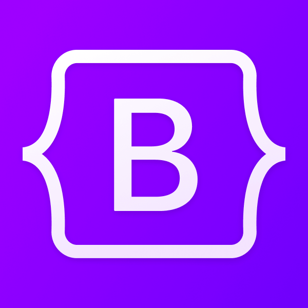
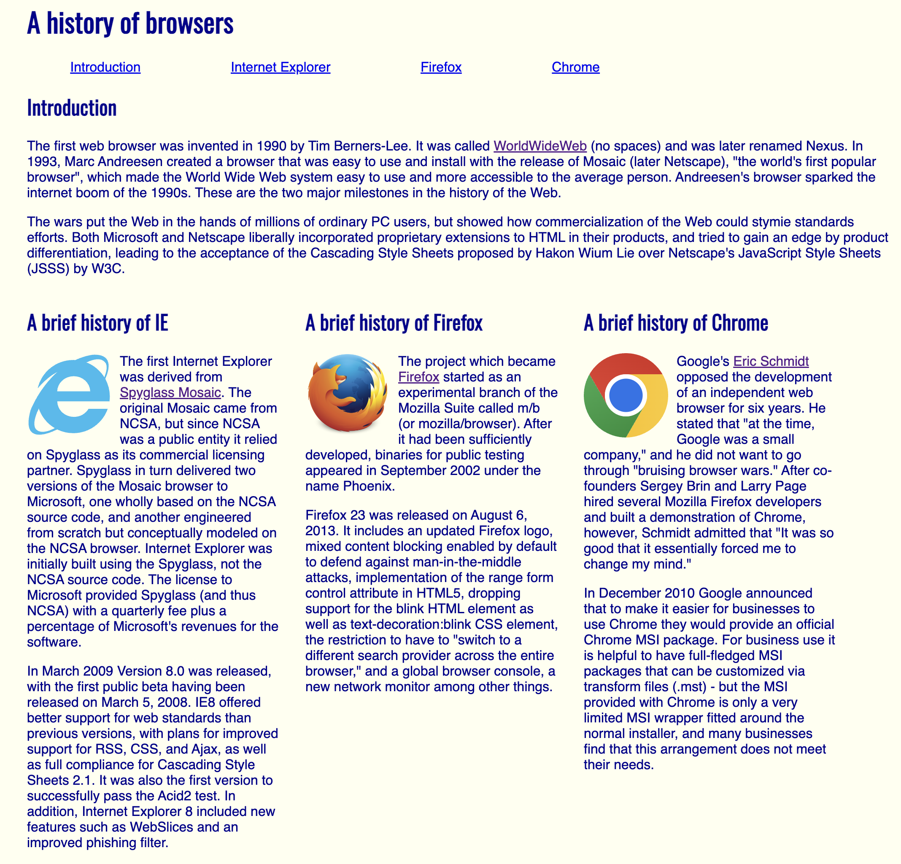
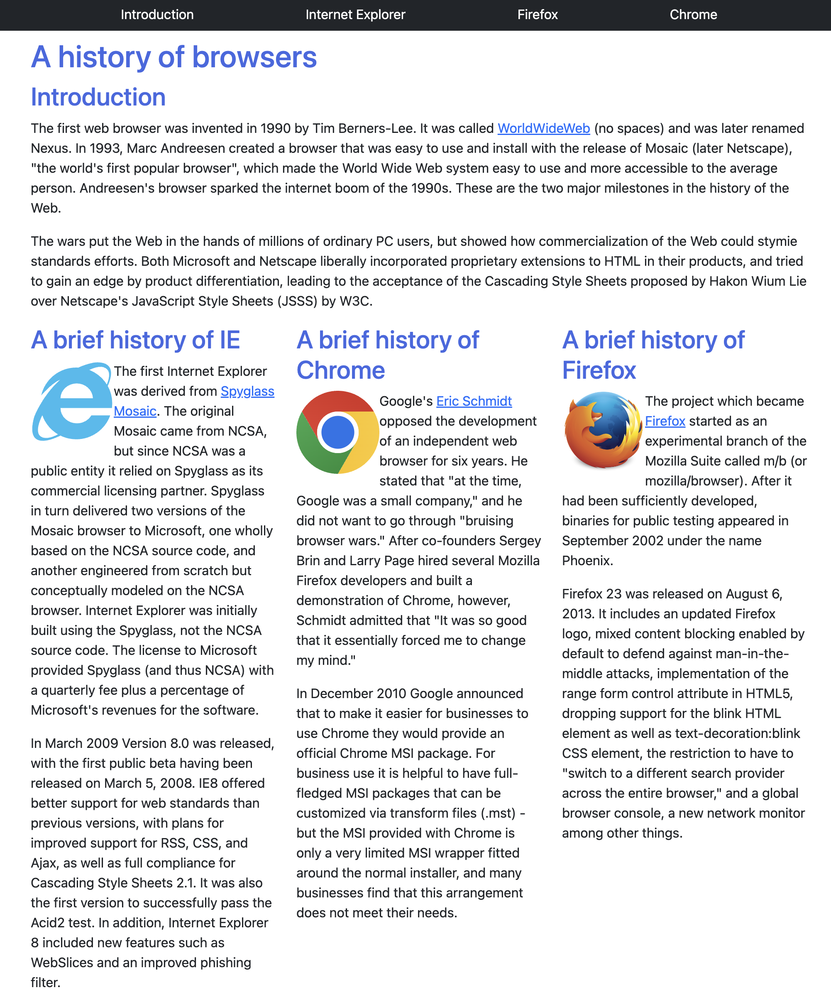

## The Introduction: HTML and CSS

The initial learning of Hypertext Markup Language (HTML) and Cascading Style Sheets (CSS) through FreeCodeCamp felt similar to the one done for JavaScript: long, foundational, but necessary. In addition, the BrowserHistory WOD really encapsulates 
the HTML and CSS experience: using tags and classes to style your website. While basic, it was a necessary foundation to be introduced to UI frameworks in the later week.

## UI Framework and Bootstrap 5

What is a user interface (UI) Framework? It "provides a set of CSS classes and/or Javascript functions that: (1) simplify the development of layout, (2) provide an attractive look-and-feel, and (3) provide consistent results across browsers."
There are many UI Frameworks that exist out there: jQuery, Metro UI, YUI Library, Bootstrap, etc. The Bootstrap 5 framework was taught to me in ICS 314; why? It is a popular, well-designed, and an open-source UI framework. Additionally, it provides
responsive, mobile-first design as a framework. Bootstrap 5 was my first ever encounter with a UI framework. It fitted nicely in my progressive learning coming from the UI Basics module, where the transition to using Bootstrap 5 in the
BrowserHistory WOD really showed its advantages.

## What's Different?: The Code

The following codes demonstrate the efficiency and simplicity resulting from just using HTML and CSS to using the Bootstrap 5 framework:

With using just HTML and CSS, the style.css stylesheet had the following styling for the classes contained in the index.html file:

```angular2html
body {
  font-family: 'Open Sans', sans-serif;
  color: darkblue;
  margin: 10px 50px 10px 50px;
  background-color: ivory;
}

h1, h2 {
  font-family: 'Oswald', sans-serif;
}

img {
  float: left;
  margin-right: 10px;
}

.column-left {
  float: left;
  width: 300px;
  padding: 1em;
}

.column-right {
  float: right;
  width: 300px;
  padding: 1em;
}

.column-center {
  margin-left: 300px;
  margin-right: 300px;
  padding: 1em;
}

#navbar ul {
  list-style-type: none;
  margin: 0;
  padding: 0;
}

#navbar li {
  display: inline;
}

#navbar a {
  margin: 0 100px 0 100px;
}
```

In comparison, with Bootstrap 5, the style.css reduces to the following while keeping the HTML nearly identical:

```angular2html
a.nav-link {
  color: white;
}

h1, h2 {
  color: royalblue;
}
```

The above code snippets showcase my intuitive understanding of the benefits: using a UI framework with HTML and CSS is like using a library while coding in JavaScript. Imagine trying to program in JavaScript without the usage of any of the libraries,
in particular from experience, the Underscore library: it would be a grueling process and unintuitive coding process. Using Bootstrap is a similar feel, the process of creating the HTML website feels more intuitive and relies more on your 
understanding of what you are trying to achieve, from which you will simply put the corresponding classes in the correct places, rather than manually coding in each individual CSS styles.

## What's Different: The Website

In addition to the efficiency and simplicity of the code, the resulting websites also feel and look better:




From the images above, the left shows a website creation with just HTML and CSS, and the right shows one created with Bootstrap; both relate to the aforementioned code snippets. The bootstrap version, in addition to the coding benefits, has a 
more responsive look when the windows are being resized and adjustments made automatically as necessary. The top navigation bar also has a much cleaner look.

## Conclusion: What's Different?

UI Frameworks, given their integration and benefits of efficiency and usability, are an integral part of the software engineering process. Personally, I still have much to learn from using the Bootstrap 5 framework, but also look forward to 
potentially using other frameworks in the future.