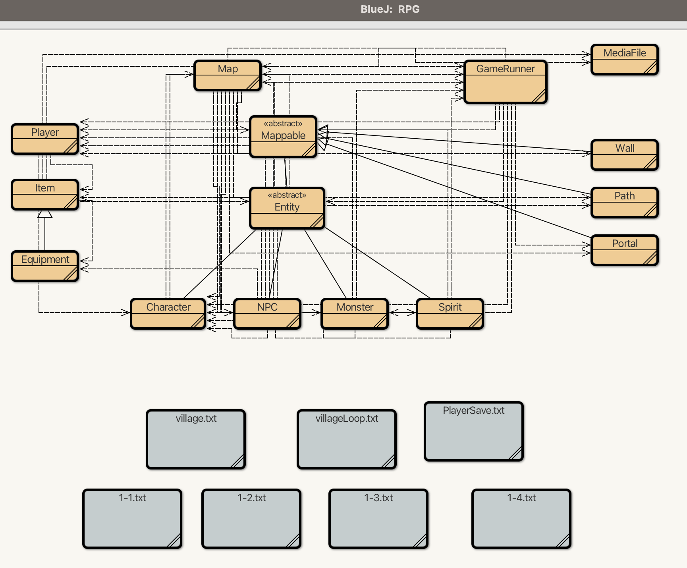
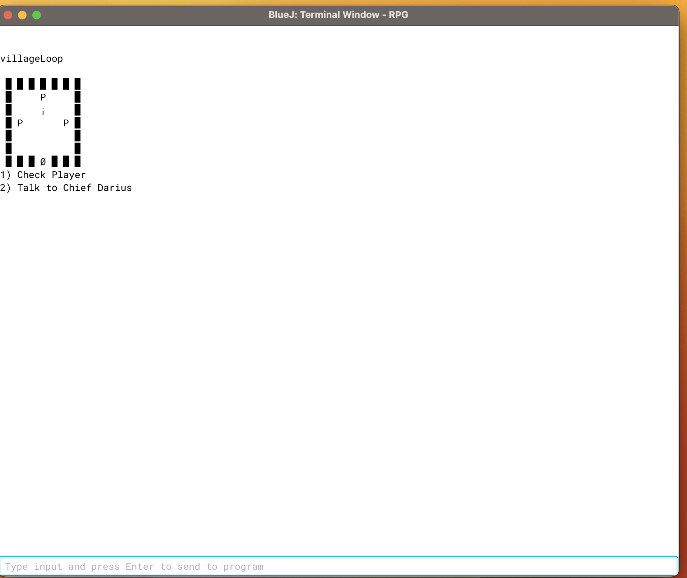
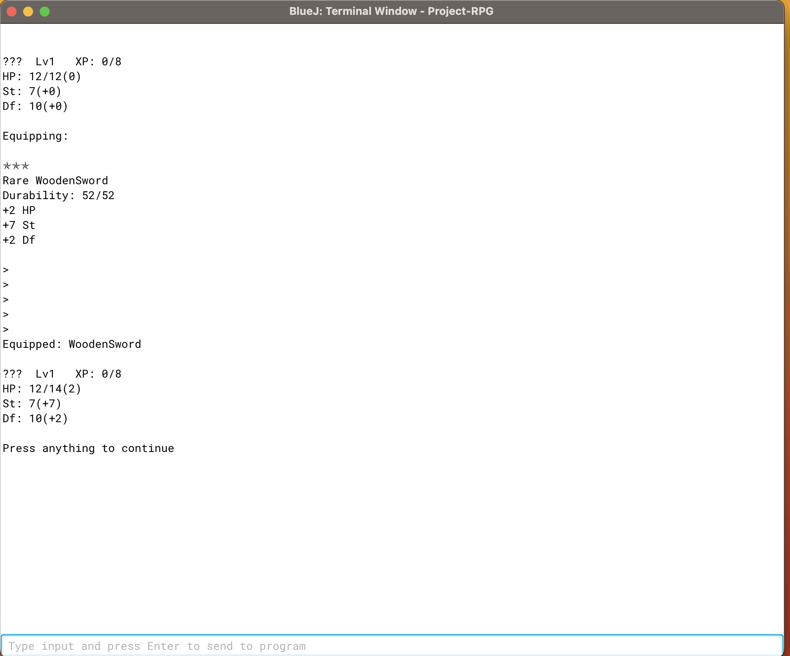
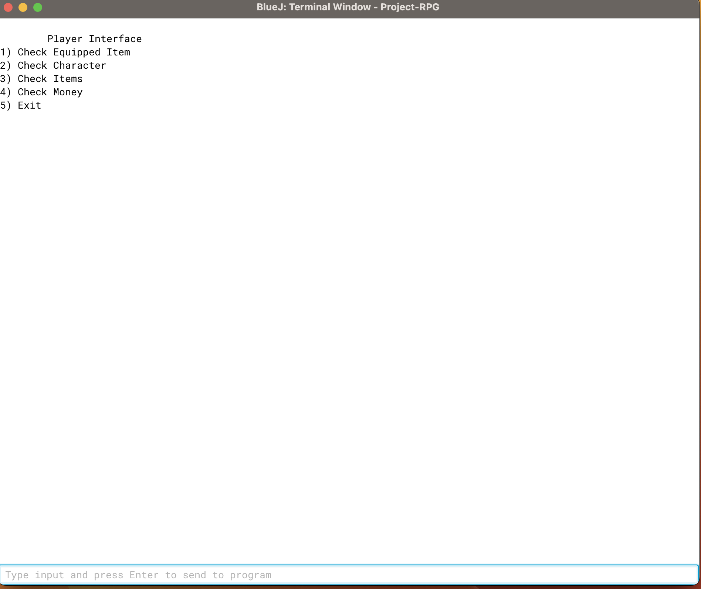
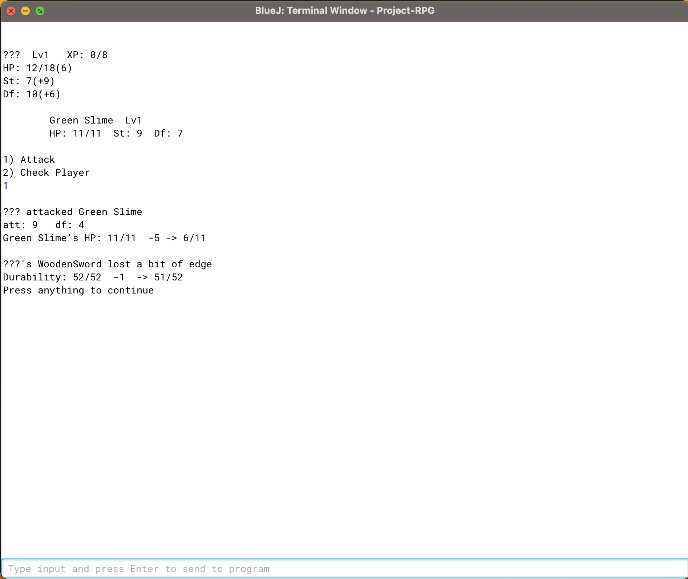
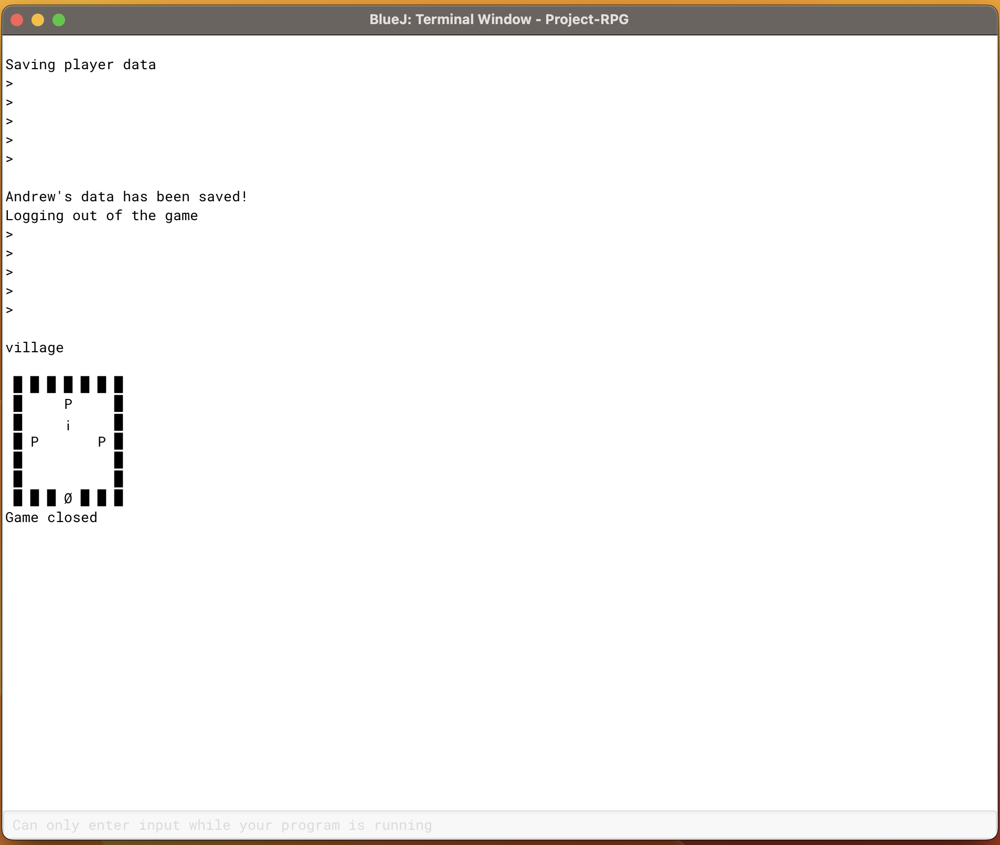

As a project for AP Computer Science A, we were to design a role-playing game in java. The project was developed using the BlueJ IDE. and took place throughout the span of a few months, with mini-assignments for each elements of the requirements for the project. I took my inspiration for my RPG project from an old obsolete flash ARPG game called \"Arcuz.\" I wanted to incorporation elements from Arcuz such as the monsters, NPC interactions, equipments, and battles.

An emphasis was placed on understanding Java inheritance with classes and subclasses. The following image showcases all the classes implemented in the BlueJ project:

The user interface was done solely using the blueJ console. The \"Map\" of the game was a 2D array representation, with a movable character (the player) as the icon 'i'. Each map is stored in a '.txt.' file, with a couple of prebuild maps that makes up the project's gameplay experience.
 - The 'Mappable' abstract class defined what objects can be displayed on the map, which included 'Wall' (defined boundries of the map), 'Path' (traversable indices for the player), 'Portal' (special object that will take the player to another map, and entities ('Character', 'NPC', 'Monster','Spirit')
 - 'GameRunner' is the main class that starts the game in the console
 - MediaFile is a utility class to load and save the game files and progress
 - 'Player' can have 'Equipment' as 'Item' or in-game potions that wiill heal and/or strengthen the character.

The following contains a few images of the game play experience:
 - Starting village of the game

 - Player equipping an item ('Equipment')

 - Player Interface in the game to do various actions with the character

 - Sample battle with a Green Slime 'Monster'

 - Player's data being saved and exiting the game ('PlayerSave.txt')

Feel free to look at my sources and/or download the files to play the game yourself: [link](https://github.com/andrewlin808/rpg).
